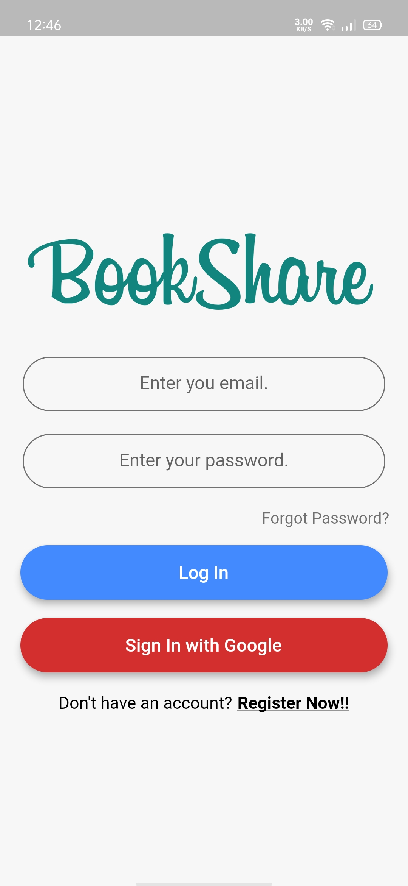
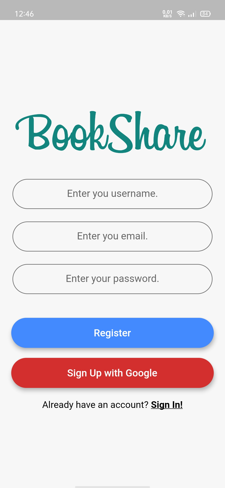
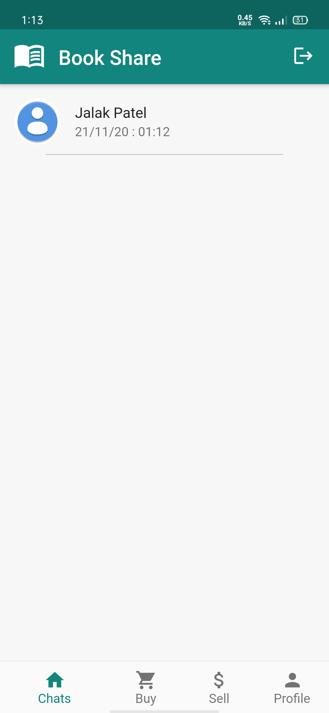
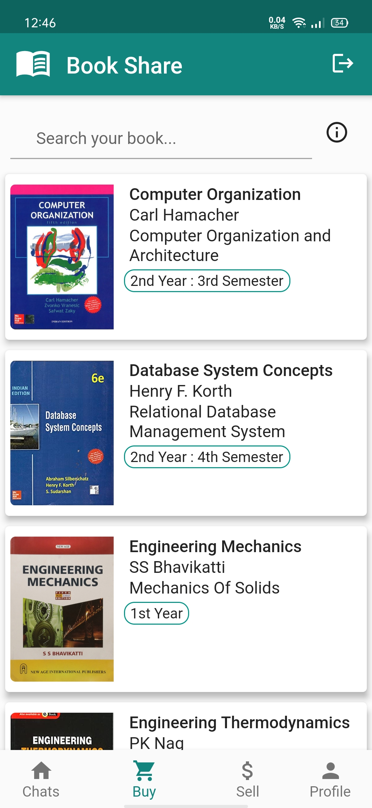
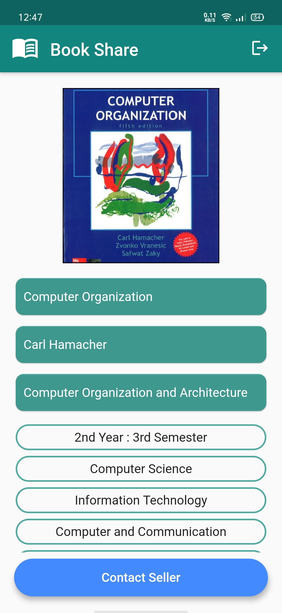
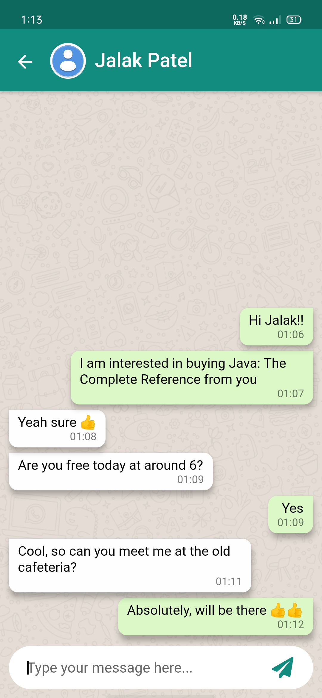
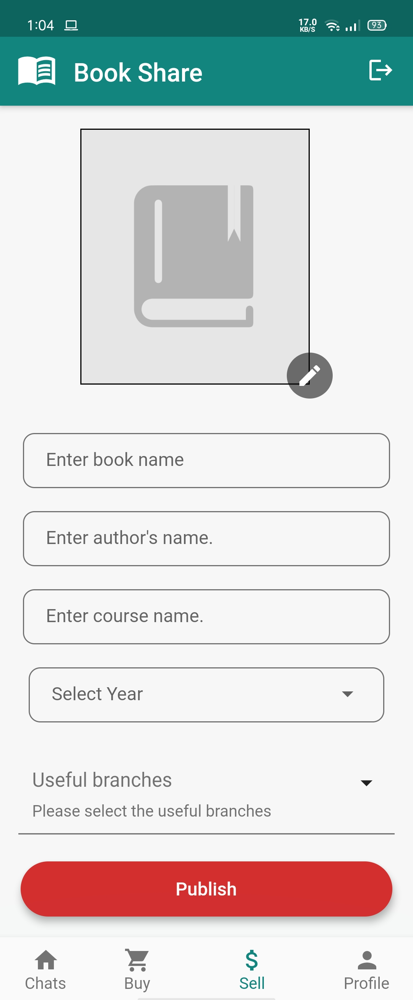
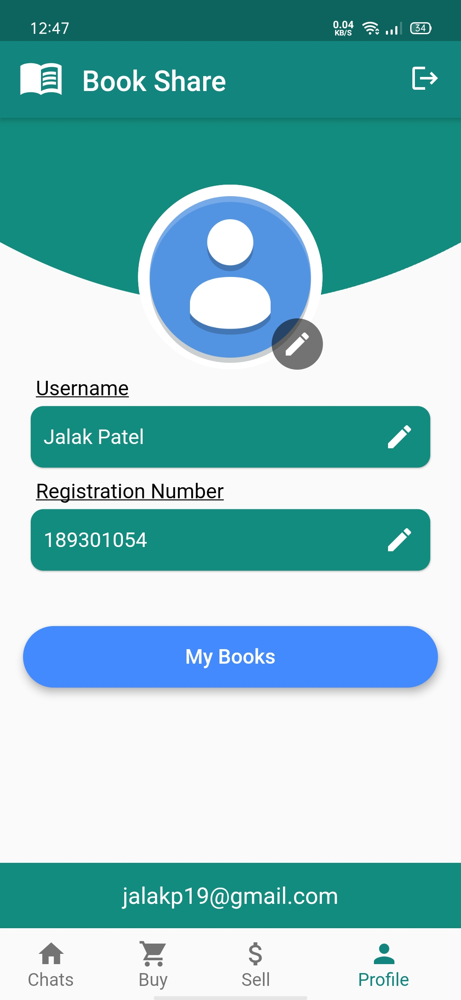
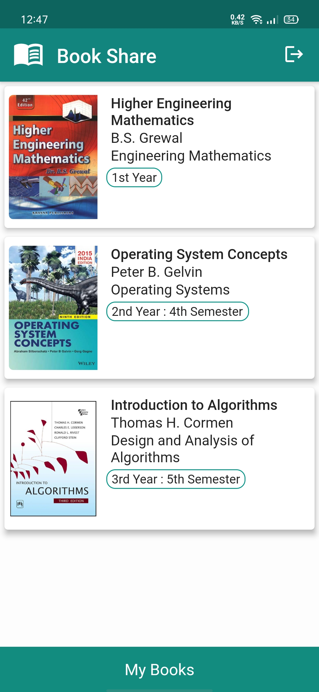
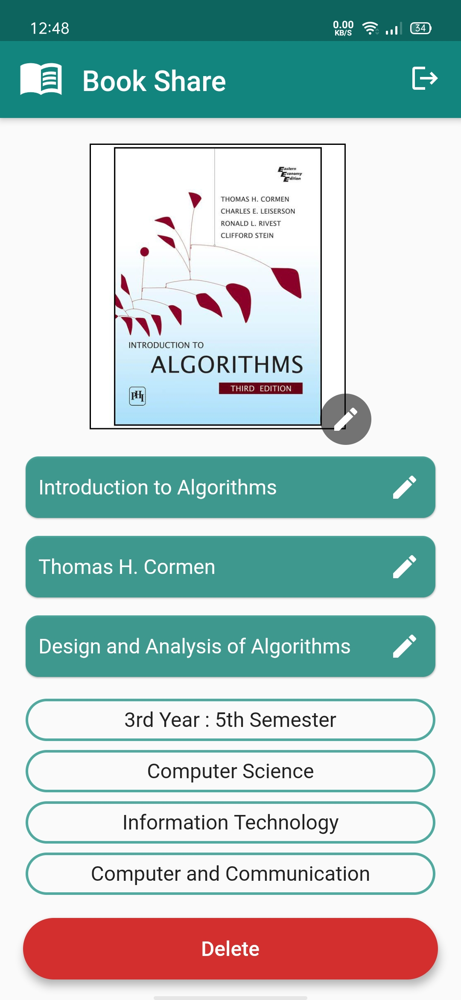

# Book Share

Book Sharing/Renting Application for university students

## Images

                           

## About

- Login Screen: You can login with email and password as well as google. Upon forgot password, you will be sent a password reset link
- Register Screen: You can register through email as well as google. You will be sent an email verification link. Once verified, only then you will be able to logIn
- Chat Screen: All your chats will be displayed here with the most recent chat at the top
- Buy Screen: All the books which are available to buy are displayed here. You can search for any book by:
   - Book name
   - Author's name
   - Course name
   - Year/Semester
   - Branch name
- Book View Screen: All the details of the book will be displayed here. On clicking contact seller button, you will be directed to the chat room.
- Chat Room: You can text the seller here and procede further. In-built chat service is provided for privacy reasons.
  (To learn more about the Chat Service, you can view my previous project [here](https://github.com/jalakp19/QuickChat "Github"))
- Sell Screen: You can not only buy books but also sell them if they are no longer required. Fill in all the details and click on publish button, you will be redirected to Mybooks screen
- Profile Screen: You can always edit your Profile i.e Your Display picture, Username and Registration Number. On clicking My Books button, you will be redirected to Mybooks screen
- My Books Screen: All the books which you want to sell appear here. On clicking any of the books, you will be redirected to an editable Book View Screen
- Editable Book View Screen: You can edit the details of your book. Delete button will permanently delete that book from your record.

## Technologies Used

- Flutter
- Firebase
   - Firebase Auth (lib/services/auth.dart)
   - Cloud Firestore (lib/services/crud.dart)
   - Firebase Storage (To store profile pictures of users and Book images)
   
---
   
>Feel free to use the code in your own Flutter project

## Author

**- Jalak Patel (https://github.com/jalakp19)**
